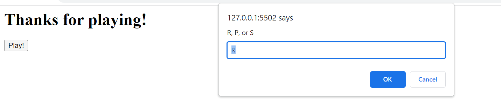

# <Rock-PaperScissors>

## Description
-A game of Rock, Paper, Scissors played through prompts and and alerts

## Usage

-Hit the play button

-Type R, S, or P into the dialouge prompt

-Click through the Alerts that let you see who won, you on the computer and the updated score

-Choose to play again or not

## Credits

UofO EdX Bootcamp Coursework